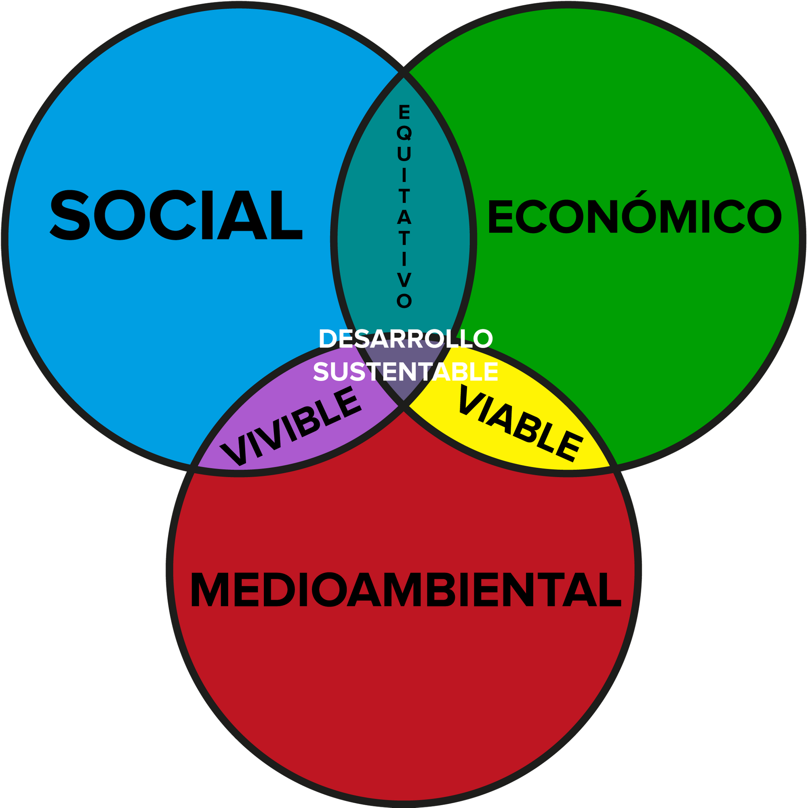
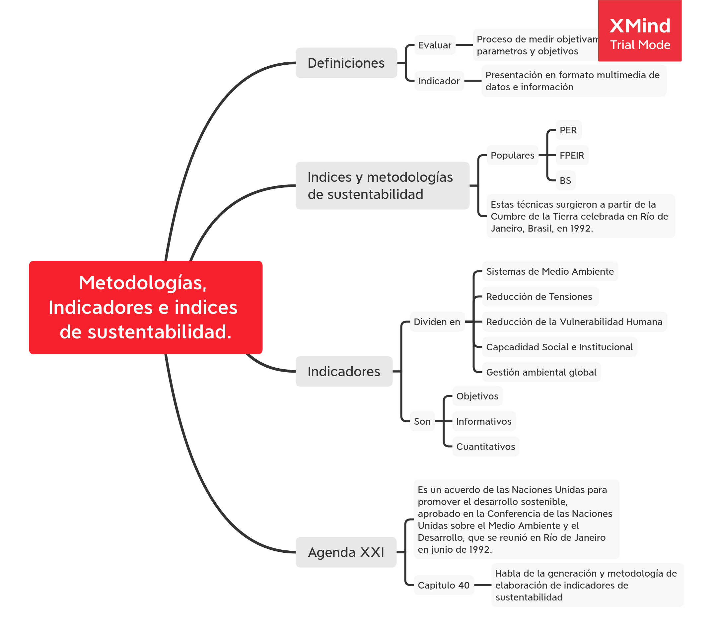

# Desarrollo Sustentable v1

__Periodo:__ Julio 2020 \
__Fecha limite actividades:__ 29/07/2020 \
__Asesor:__ Juan Carlos Pizano Andrade

## Unidad 1. Importancia del desarrollo sustentable y su evaluación

| Retos | Lecciones | Ponderación |
|---|---|---:|
|  |1. Qué es el desarrollo sustentable? | |
|1. Conceptos básicos sobre sustentabilidad  |  |10% |
|  |2. Dependencia de la sustentabilidad ambiental... | |
|  |3. Dimensiones y retos de la sustentabilidad | |
|  |4. Problemas ambientales globales
|  |5. Evolución de la gestión ambiental internacional | |
|2. Conceptos sobre sustentabilidad |  |15% |
|  |6. Evaluación de la sustentabilidad | |
|  |7. Metodologías para el desarrollo de indicadores | |
|3. Metodología para evaluar la sustentabilidad | |20% |

### Lección 1

> __Desarrollo sustentable__, o sustentabilidad, es la capacidad de existir sin atentar contra las generaciones futuras moderando nuestro consumo.

#### Datos imporantes
 - El __informa de Brundtland__ (de 1987) propone que el desarrollo sustentable es el punto de equilibrio entre los intereses sociales, económicos y mediambientales. Además fué el primer artículo en poner en el foco internacinoal al _desarrollo sustentable_.

 - La __idea de sustentabilidad__ surge con la comprensión de que el desarrollo de la sociedad debe estar _centrado en el hombre_ y no en los indices económicos
 
 - El __desarrollo__ es el _crecimiento cualitativo_ de ciertos aspectos de un grupo o individuo.
 
 - En español, __sustentable__ implica _soporte, fundamento y basamento_
 

### Reto 1

[archivo](./Rivera_Benjamin_R1_U1.ods) \
[entregable](./Rivera_Benjamin_R1_U1.pdf)

### Lección 2

> __Sustentabilidad ambiental__ es la relación entre el ser humano con su ecosistema.

> __Desarrollo sostenible__ Aquel que permite satisfacer nuestras necesidades sin comrpometer la capacidad de las generaciones futuras de satisfacer las suyas.

> __Desarollo sustentable__ Es la estretegia que busca equilibrar los intereses economicos, sociales y ambientales para tener un _desarrollo sostenible_

### Lección 3

Como se ha mencionado anterioremente, el _desarrollo sustentable_ se base en el cuidado de tres dimensiones, que son: __Económica__, __Social__ y __Ambiental__

las cuales estan interrelacionadas entre si para lograr un _desarrollo sustentable_. Dentro de las dimesiones antes mencionadas se encuentran 11 problematicas principales que limitan el desarrollo que buscamos, las cuales son

- __Económica__
	- Pobreza
	- Consumismo
	- Marginación
	- Residuos peligrosos
- __Social__
	- Crecimienot demográfico
	- Salud humana
	- Abastecimiento de agua
- __Ambiental__
	- Deforestación
	- Contaminación
	- Perdida de diversidad
	- Cambio climático

### Lección 4

Las situaciones que afectan de raiz al ambiente global son

- __Crecimiento piblacional__
- __Demanda de recursos__
- __Perdida de ecosistemas__
- __Cambio climatico__
- __Bienestar humano__

Y esto nos lleva a tener probemas ambientales preocupantes, los que más nos importan son:

- __Contaminación__
	- Agua
	- Suelo
	- Aire
- __Deforestación__
- __Degradación del suelo__
- __Energia__
- __Escaces de agua__
- __Perdida de Biodiversidad__
- __Residuos__

### Lección 5

> __Gestión ambiental__ Conjunto de acciones y estrategias que rigen las actividades humanas y que influyen sobre el ambiente tratando de lograr un Desarrollo sostenible.

Esta fue impulsada por la __CNUMAH__ (Conferencia de Naciones Unidas para el Medio Ambiente) y por la __CNUMAD__ (Conferencia de las Naciones Unidas sobre el medio Ambiente y Desarrollo)

Algunas de los organizmos que se interesna por esto son:

- CILA-MEX
	- Comisión Internacional de Limites, entr USA y México
	- Se creo en 1889
	- Se encarga de resolver problemas de localización de frontera relativos a los movimientos de los ríos Bravo y Colorado.
	
- CILA
	- Comisión Internacional de Limites y Aguas
	- Se creo en 1944
	- Se encarga de planear, construir, operar y mantener diferentes plantas de tratamiento de agua en el área de la frontera. 
	
- EEA
	- Agencia Ambiental Europea
	- Se creo en 1951 y opera en diversos paises de Europa
	
- OECD
	- Organización para la Cooperación y el Desarrollo Económico
	- Se creo en 1960 y es una organización intergubernamental donde se analiza el desarrollo económico y relacionados.
	
Es importante recalcar que la CEC, la CONCAMIN, la USCIB y la CCIB, fueron comisiones creadas como resultado del momorándum de entendimiento sobre educación ambientel de 1992

### Lección 6

> __Evaluar__: Estimar, apreciar, calcular valor de algo

> __Indicador__: Variables que permiten obesrcar y medir la realidad.

Existen tres estrategias para __evaluar la sustentabilidad__

1. _Marcos de referencia para la definición de indicadores_, esta considera
	- Considera objetivos o proceso sistémico
	- Por tipo de evaluación
	- De acuerdo al sistema puede ser de _aab_ o _baa_
	- Integración de indicadores multimedia
	- Validación mediante estudio del caso

2. _Metodologías para elaborar indices de sustentabilidad_
	- Indice de desarrollo sustentable (IDS)
	- Barómetro de Sustentabilidad (BS)
	- Indice de Sustentabilidad Ambiental (ESI)

3. _Lista de indicadores de la sustentabilidad_

### Lección 7

El capitulo 40 de la _agenda XXI_ pide la generación de indicadores de desarrollo sustentable. Los modelos que más se aplican a nivel internacional son:

- __PER__: Presión, estados y resultados
	- Modelo ciclico y empieza haciendo algo y esperando una respuesta
- __FPEIR__: Fuerzas motrices, presión, estado, impacto y respuesta
	- Basado en _PER_ pero es más agresivo
- __BS__: Barometro de sustentabilidad
	- Compara el bienestar humano con el del ecosistema en cada uno de sus apartados, y los valores osilan entre 1 y 0.
	
El __modelo de la ECDE__ únicamente ayuda a comparar paises entre si, no a medir su sustentabilidad, y utiliza los modelos _PER_ y _FPEI_.

### Reto 3

#### Instrucciones

##### Responde lo siguiente

1. ¿Qué entiendes por Evaluar? Evaluar es el proceso de medir objetivamente parametros y objetivos.

2. ¿Qué entiendes por Indicador? Es una presentación, en formato de multimedia, de datos y/o información.

3. ¿Cuáles son los tres índices de sustentabilidad más empleados? Respondido en la siguiente pregunta.
4. Indica una palabra que califique a cada índice.
	- PER - Acción-reacción 
	- FPEIR - Agresivo
	- BS - Objetivo

5. ¿Cómo están clasificados los 20 indicadores del índice ESI?
	- Sistemas de Medio Ambiente
	- Reducción de Tensiones
	- Reducción de la Vulnerabilidad Humana
	- Capacidad Social e Institucional
	- Gestión ambiental mundial

6. Al menos escribe 2 variables de cada indicador.
	- Calidad del aire
		- Concentración de SO2 urbana
		- Concentración de TSP urbana
	- Calidad del agua
		- Agua renovable interna per capita
		- Ingreso per capita de agua proveniente de otros paises
	- Calidad del agua
		- Concentración de ocígeno disuelto
		- Sólidos en suspensión
	- Biodiversidad
		- Porcentaje de mamiferos amenazados
		- Porcentaje de área de tierra que tiene un alto impacto antropogénico
	-Tierra
		- Porcentaje de tierra que tiene un muy bajo impactoantropogénico
		- Porcentaje de área de tierra que tiene un alto im-pacto antropogénico
	- Reducción de la polución del aire
		- Vehículos por área de tierra poblada
		- Consumo de carbón por área de tierra poblada
	- Reducción de las tensiones de agua
		- Uso de pesticidas por hectárea de tierra cosechada
		- Consumo de fertilizantes por hectárea de tierra cultivable
	- Reducción de la tensión del ecosistema
		- Cambio forestal cubre 1990-2000
		- Porcentaje del distrito con excedencia de acidificación
	- Reducción de desechos y tensiones de consumo
		- Huella ecológica per capita
		- Desechos radioactivos
	- Reducción del crecimiento de la población
		- Tasa total de fertilidad
		- Cambio porcentual en la población proyectada entre 2001 y 2050
	-Sustento humano básico
		- Proporción de desnutridos en el total de la población
		- Porcentaje de la población con acceso a suministro mejorado de agua potable
	- Salud del medio ambiente
		- Tasa de mortalidad bajo -5
		- Tasa de muerte debido a enfermedades infecciosas
	- Ciencia y tecnología
		- Indice de logros tecnológicos
		- Promedio de años de educación
	- Capacidad de debate	
		- Libertades civiles y políticas
		- Instituciones democráticas
	- Autoridades del medio ambiente
		- Control de corrupción
		- Subvenciones para la energía o uso de materiales
	- Grado de interés del sector privado
		- Índice del Grupo de sustentabilidad Dow Jones
		- Promedio de la clasificación de las compañías (Average Innovest EcoValue)
	- Eco-eficiencia
		- Eficiencia de energía
		- Producción de energía renovable como porcentaje consumo total de enrgía
	- Participación en esfuerzos de colaboración internacional
		- Número de membresías en la organizaciones inter-gubernamentales de medio ambiente
		- Cumplimiento con los acuerdos sobre medio ambiente
	- Emisiones de gases invernadero
		- Eficiencia, estilo vida del carbón 
		- Eficiencia económica del carbón  
	- Reducción de presiones medioambientales transfronterizas
		- Exportaciones de SO2
		- Captura total de peces marinos
	
7. ¿Te has preguntado para que nos sirve evaluar la sustentabilidad? Primero que nada, como hemos visto en este curso, la sustentabilidad es un objetivo social conveniente, y cualquier objetivo debe ser medido para poder ver que tanto hemos avanzado. Por otro lado, el cuidar a las generaciones que apenas vienen debería ser motivación suficiente para cualquiera.

8. ¿Cuáles son los requisitos que debe cumplir un indicador? Debe ser objetivo, informativo y amigable a la vista.

9. ¿Cómo nos ayuda ESI en la evaluación de la sustentabilidad? ESI es una herramienta que podemos utilizar para medir objetivamente el progreso de los paises y regiones en materia de desarrollo sustentable.

10. ¿En dónde y cuando surgen las técnicas y metodologías para evaluar la sustentabilidad? Estas técnicas surgieron a partir de la _Cumbre de la Tierra_ celebrada en _Río de Janeiro, Brasil_, en 1992.

11. ¿En qué reunión internacional nació la agenda 21? Esta agenda fue aprobada durante la _Conferencia de las Naciones Unidas para promover el desarrollo sostenible_, en _Río de Janeiro_ en 1992.

12. ¿Qué importancia tiene el capítulo 40? Habla de la generación de indicadores de desarrollo sustentable.

13. ¿Cuáles son los tres modelos o metodologías para el desarrollo de indicadores más importantes internacionalmente? Existe una infinidad de metodologías relevantes para este proposito, peor las que más se mencionan son __IDS, BS__ y __ESI__
 
14. ¿Qué significan las iniciales PER? ¿En qué año inicia su aplicación? Es un metodo desarrollado en 1970 por Anthony Fiend, son siglas de __Presión-Estado-Respuesta__

15. ¿Qué significan las iniciales FPEIR?  ¿En qué año inicia y a partir de que se diseña? Es un método analítico, que son siglas de __Fuerzas conductoras-Presión-Estado-Impacto-Respuesta__ y es un metodo extendido de _PER_.

16. ¿Porquéen los modelos PER y FPEIR son un ciclo? Porque son métodos iterativos que mientras más se van aplicando es más precisa la información que ofrece del ecosistema.

17. _Explica brevemente cómo se maneja la gráfica del modelo BS._ Esta herramienta grafica el desarrollo social contra el desarrollo ambiental de cada uno de las variables de interes, dandole valores cercanos a 1 cuando el resultado es bueno y cercanos a 0 cuando todo esta mal.

#### Cuadros sinópticos

1. Metodologías,Indicadores e índices con la evaluación de la sustentabilidad. 

2. Modelos de medición de la sustentabilidad.

#### Fuentes de información

- Esty, D.. (2002). _ÍNDICE DE SUSTENTABILIDAD DELMEDIO AMBIENTE 2002_. 14 de Julio de 2020, de Yale University Sitio web: https://core.ac.uk/download/pdf/132236439.pdf
- Saldivar, A., Barrera, A., Rosales, P., & Villaseñor, E.. (2002). _TRES METODOLOGÍAS PARA EVALUAR LA SUSTENTABILIDAD	: 10 AÑOS DESPUÉS DE RÍO_. 14 de Julio de 2020, de UNAM | PIMAS Sitio web: http://www.scielo.org.mx/pdf/ineco/v62n242/0185-1667-ineco-62-242-159.pdf

## Unidad 2. Tópicos de debate sobre desarrollo sustentable.

