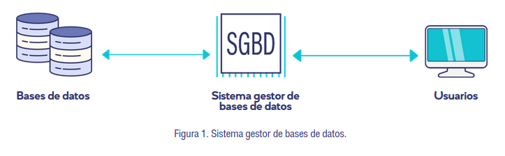
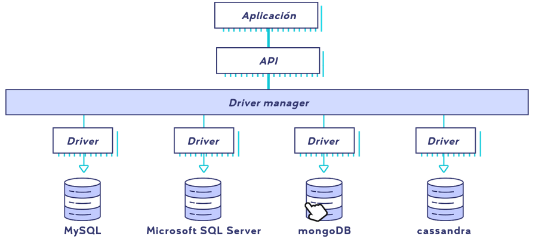

# Taller de bases de datos v2
___MTBD___

__Periodo:__ Agosto 2020

__Fecha limite actividades:__ 26/08/2020

__Asesor:__ Araceli González García

Este curso tiene como objetivo general hacer que el estudiante aprenda a manipular las bases de datos considerando la integridad y seguridad de la información. esto bajo los estándares de modelado de sistemas informáticos, para solucionar problemas reales.

El curso estara distribuido en 3 unidades, repartidas en 24 días,  y se requiere una calificación minima de 70 para aprovar.

## Unidad 1.

| Retos | Lecciones | Ponderación |
|---|---|---:|
|  |L1. Sistema de gestor de bases de datos | |
|  |L2. conectar una base de datos | |
|R1 Sistemas gestores de bases de datos (SGBD): análisis|  | 15%|

### Lección 1. Sistema de gestor de bases de datos

Los __Sistema de gestor de bases de datos__, o __(SGBD)__ por sus siglas, es

> una aplicación que funciona como intermediario entre los usuarios y las bases de datos

estas aplicaciones permiten _crear_, _manipular_ y _respaldar_ bases de datos.

Ejemplo de estas aplicaciones son
 - Microsoft Access
 	- Programa utilizado por supermercados

Existen dos tipos de bases de datos, y por lo tanto dos tipos de SGBD para manipular cada uno de ellos, y la diferencia entre estos radica en la manera en que guarda la información, estos tipos son
 - SQL
 	- Modelos de datos relacionales
 	- Ejemplos
 		- MySQL
 			- Más usado
 			- Bases de datos no muy grandes
 		- Oracle 
 			- Más usado en ambiente empresarial y el más popular en la actualidad
 			- Orientado a _web apps_
 		- Postgre SQL
 			- Usado por aplicaciones _POO_
 			- Grandes volumenes de datos
 			- Usado en investigación y estadística
 		- SQL Server
 			- Usado por la familia _.NET_
 			- Soporte exclusivo de Microsoft
 - NoSQL
 	- Modelos de datos documentales
 	- Ejemplos
 		- mongoDB
 			- Bases amplias que requieren escalabilidad
 			- Usado por Google, Facebook, eBay
 		- redis
 			- Aplicaciones de almacenamiento en memoria caché y de administración de sesiones
 			- Popular en _web apps_, moviles y juegos
 		- cassandra
 			- Aplicaciones de monitoreo de usuarios y _IoT_
 			- Usado por Instagram, Twitter y Netflix

Todas y cada una de estas aplicaciones posee tres funciones básicas sobre las bases de datos
 - Creación y definición
 	- Define la estructura, los tipos de datos y realciones entre ellos.
 - Manipulación de datos
 	- Realiza consultas, inserciones y manipulación de estos.
 - Acceso controlado
 	- Restringe el acceso mediante usuarios.
 	
 	
### Lección 2. Conectar una base de datos.

Las conexiones a las bases de datos suelen hacerse mediante __API's__, que sirven como filtro e identificador entre el usuario y alguna aplicación web.

En el esquema anterior identificamos el esquema de uso de una base de datos. La __aplicación__ es algúna desarrollada capaz de conectar con una base de datos. La __API__ es la interfaz que permite la interacción entre el _SGBD_ y la _aplicación_. Los __Driver manager__ son aquellos que realizan operaciones en la base de datos; algunos son _ODBC, JDBC, ADO.NET_. Los _controladores (driver)_, son aquellas que tienen una directa interacción con las _SGBD_. Y al final estan las __SGBD__, que estamos estudiando actualmente.

Las __API__ de cada _driver manager_ requieren de parametros especificos para devolver una respuesta acertada. Como por ejemplo
 - ODBC (Open DataBase Conectivity)
 	- Requiere los parámetros:
 		- Ubicación de la base de datos (IP)
 		- Puerto de conexión
 		- Ususario
 		- Contraseña
 		- Base de datos
 - JDBC (Java DataBase Connectivity)
 	- Aplicaciones que especificamente usen Java
 	- Requiere los parámetros:
 		- Ubicación de la base de datos (IP)
 		- Usuario
 		- Contraseña
 		- Base de datos
 - ADO.NET (ActiveX Data Objects.NET)
 	- Requiere los parámetros:
 		- Ubicación de las base de datos (IP)
 		- Usuarios
 		- Contrseña
 		- Base de datos

Un caso especial de las conexiones se da con los dispositivos moviles. Como la mayoría de sus aplicaciones estan programadas en _Java_ se suele utilizar _JDBC_, y por lo tanto se requieren los parámetros antes mencionados.

### Reto 1. 

Saludos profesora

Esta es mi confirmación de lectura de su mensaje de bienvenida. Y mi __Reto 1__.

Mi nombre es Benjamín Rivera, tengo 22 años y soy de Guanajauto. Mi pasatiempo favorito es leer. Espero adquirir habilidades prácticas en este m[odulo.

Algunos lugares donde se utilizan las bases de datos son:

 - En las paginas web, como en <https://datos.gob.mx/>,  donde se publica información abierta para que todos puedan utilizarla en distintos proyectos.
 - En hospitales, a pesar de que no todos lo implementan, existen hospitales que llevan un registro electrónico de los pacientes que estan en el edificio.
 - En las escuelas, la mayoría de las escuelas ya cuentan con bases de datos de sus alumnos que permiten hacer consultas de calificaciones y contactos de emergencia.
 
 
| Nombre del SGBD | Ventajas | Desventajas | Conclusiones personales |
|---:|---|---|---|
| Db2     | <ul><li>Soporta tanto bases relacionales, como las NoSQL</li><li>Corre en Linux, Windows y Unix-like</li><li>Respaldado por IBM</li><li>Facil integración con otros SGDB </li></ul> | <ul><li>No es software libre</li><li>Software de pago por uso</li></ul> | Parece ser un sfotware maravilloso, facilmente escalable y adaptable a distintos lenguajes de programación y adapatativo a la aqruitectura; adempas esta respaldado por una compañia muy importante como IBM. La única desventaja es que es un software privativo, aunque es de esperarse con todas las caracteristicas que tiene |
| OrientDB| <ul><li>Open Source</li><li>Escrito en Java</li><li>Soporta bases de datos con estructura de grafos, documentos, relacionales y orientada a obejtos</li></ul> | <ul><li>Escrito en Java</li><li>Soporte poco eficiente</li></ul> | Primero que nada, JAVA, yo en lo personal tengo una relación complicada con este lenguaje de programación, lo puse e ventajas porque casi todas las maquinas tiene instalado JAVA, lo que implica portabilidad; por otro lado, Java no me parece el lenguaje más espectacular, pero eso es bastante personal. Además, este SGDB de software libre, como la mayoría de ellos, carece de un buen soporte, esto implica que los bugs tardan ens ser arreglados y no hay certesa de cuando dejara de estar el proyecto en mantenimiento. |

### Fuentes de información

 - S/D. (2020). _Introducción al sistema gestor de base de datos (SGBD)_. 2 de agosto de 2020, de IONOS Sitio web: <https://www.ionos.mx/digitalguide/hosting/cuestiones-tecnicas/sistema-gestor-de-base-de-datos-sgbd/>

 

## Unidad 2.

| Retos | Lecciones | Ponderación |
|---|---|---:|
|  |L3. Definir y crear una base de datos | |
|R2. Crear mi primera base de datos |  | 12%|
|  |L4. Manipular la información de una base de datos | |
|  |L5. Ordenar y agrupar la información de una base de datos | |
|R.3 Manipular la información de una base de datos |  | 25%|

### Lección 3

## Unidad 3.

| Retos | Lecciones | Ponderación |
|---|---|---:|
|  |L6. Seguridad en la base de datos | |
|R4. Roles y permisos sobre una base de datos |  | 12%|
|  |L7. Transacción con las bases de datos | |
|R5. TRansacciones e integridad de la información |  | 12%|
|  |L8. Procedimiento en las bases de datos |  |
|  |Autoevaluación | 5%|
|R6. Procedimientos y tareas sobre una base de datos |  | 19%1

### Lección 6

